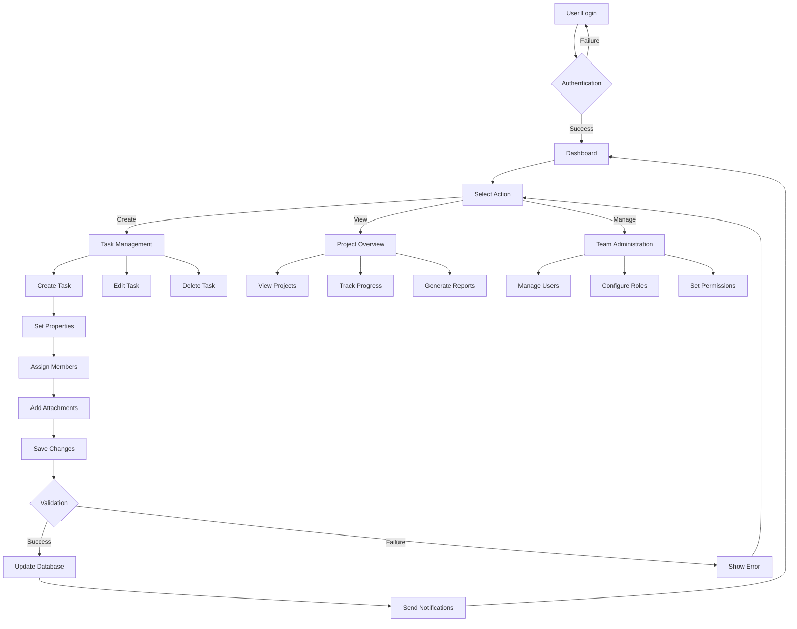
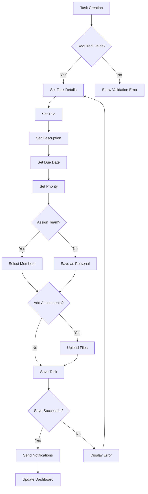
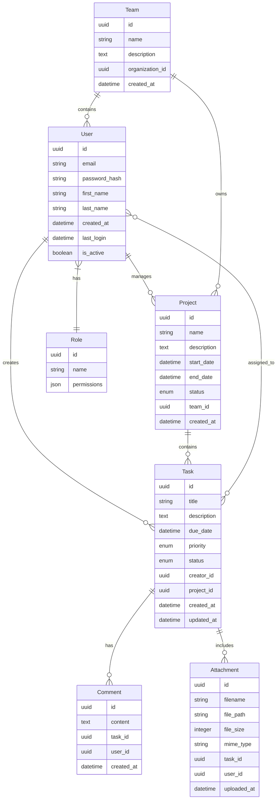
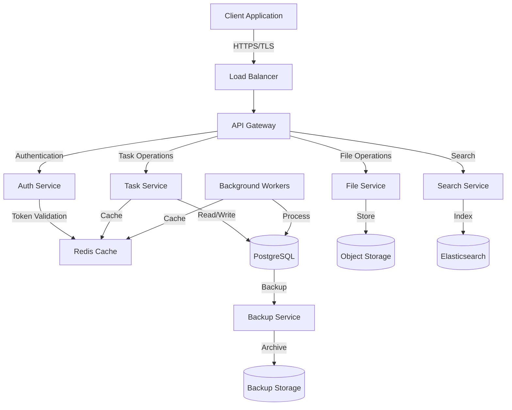
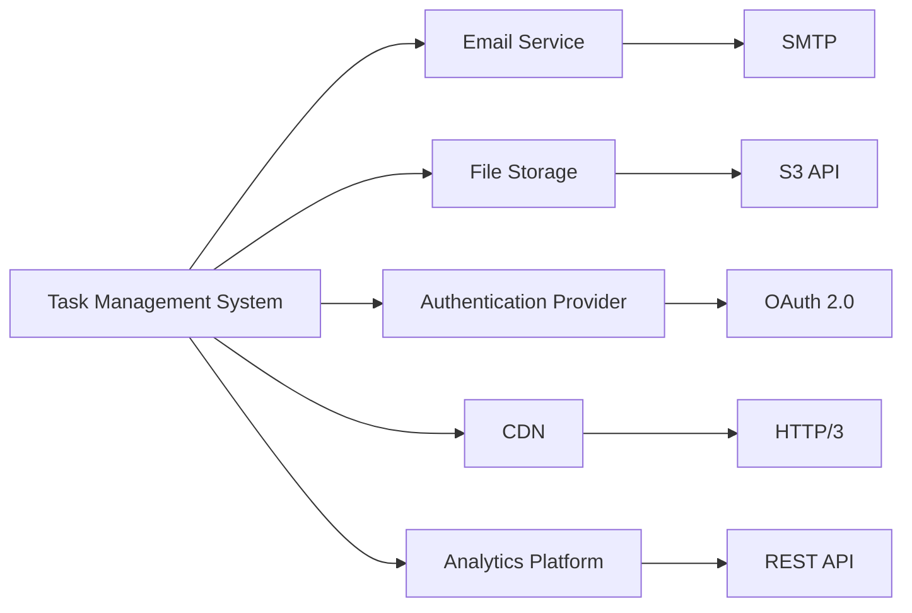

# Product Requirements Document (PRD)

# 1. INTRODUCTION

## 1.1 Purpose
This Software Requirements Specification (SRS) document provides a comprehensive description of the Task Management System. It details the functional and non-functional requirements, system constraints, and interface specifications. This document serves as the primary reference for technical and non-technical stakeholders including:
- Development team members
- Project managers and system architects
- Quality assurance testers
- Business stakeholders and product owners
- Future maintenance teams

## 1.2 Scope
The Task Management System is a web-based application designed to streamline task organization and team collaboration. The system encompasses:

### Core Functionalities
- Task creation, assignment, and management
- Project organization and categorization
- Real-time collaboration and updates
- File attachment and document sharing
- Role-based access control
- Progress tracking and status monitoring
- Dashboard visualization
- Reporting and analytics

### Key Benefits
- Improved team productivity through centralized task management
- Enhanced collaboration and communication
- Better project visibility and progress tracking
- Streamlined workflow management
- Efficient resource allocation
- Data-driven decision making through analytics
- Reduced administrative overhead

### System Boundaries
- Web browser-based interface
- User authentication and authorization
- Integration with file storage systems
- Email notification system
- Data backup and recovery
- API interfaces for third-party integrations

# 2. PRODUCT DESCRIPTION

## 2.1 Product Perspective
The Task Management System operates as a standalone web application while integrating with existing enterprise systems and services. The system architecture consists of:

- Frontend web interface accessible via modern web browsers
- Backend REST API services
- Database management system for data persistence
- File storage integration for document attachments
- Email notification service
- Authentication and authorization service
- External API integrations

## 2.2 Product Functions
The system provides the following core functions:

### Task Management
- Create, edit, and delete tasks
- Set task priorities, due dates, and status
- Assign tasks to team members
- Track task progress and completion
- Add comments and attachments

### Project Organization
- Create and manage projects
- Organize tasks within projects
- Set project milestones and deadlines
- Track project progress
- Generate project reports

### Collaboration Features
- Real-time updates and notifications
- Team communication through comments
- File sharing and version control
- @mentions and task following
- Team calendar integration

### Administration
- User management and access control
- Team creation and management
- System configuration
- Audit logging
- Analytics and reporting

## 2.3 User Characteristics

### Administrator
- Technical expertise: High
- System access: Full
- Responsibilities: System configuration, user management, security control

### Project Manager
- Technical expertise: Medium
- System access: Project-level administration
- Responsibilities: Project planning, task assignment, progress monitoring

### Team Member
- Technical expertise: Basic to Medium
- System access: Task-level operations
- Responsibilities: Task execution, updates, collaboration

### Client/Stakeholder
- Technical expertise: Basic
- System access: View-only or limited
- Responsibilities: Project monitoring, feedback provision

## 2.4 Constraints

### Technical Constraints
- Must support modern web browsers (Chrome, Firefox, Safari, Edge)
- Maximum file attachment size: 25MB
- Response time < 2 seconds for standard operations
- 99.9% system availability

### Business Constraints
- Must comply with GDPR and data protection regulations
- Authentication required for all system access
- Regular security audits and penetration testing
- Data backup every 24 hours

### Resource Constraints
- Development timeline: 6 months
- Initial deployment on cloud infrastructure
- Maximum concurrent users: 10,000
- Storage capacity: 1TB per organization

## 2.5 Assumptions and Dependencies

### Assumptions
- Users have stable internet connectivity
- Users have basic computer literacy
- Organizations have defined team structures
- Email services are available for notifications
- Modern web browsers are used for access

### Dependencies
- Cloud hosting platform availability
- Third-party authentication service
- Email service provider
- File storage service
- Database management system
- Content delivery network (CDN)
- SSL certificate provider

# 3. PROCESS FLOWCHART

# 4. FUNCTIONAL REQUIREMENTS

## 4.1 User Authentication and Authorization

### ID: FR-001
### Description
User authentication and access control system managing login, registration, and role-based permissions.
### Priority: High
### Requirements

| ID | Requirement | Priority |
|---|---|---|
| FR-001.1 | System shall support user registration with email verification | High |
| FR-001.2 | System shall provide secure login with password encryption | High |
| FR-001.3 | System shall support role-based access control (Admin, Manager, Member, Client) | High |
| FR-001.4 | System shall enable password reset via email | Medium |
| FR-001.5 | System shall support OAuth 2.0 integration for SSO | Medium |

## 4.2 Task Management

### ID: FR-002
### Description
Core task management functionality including creation, editing, and organization of tasks.
### Priority: High
### Requirements

| ID | Requirement | Priority |
|---|---|---|
| FR-002.1 | System shall allow creation of tasks with title, description, due date, and priority | High |
| FR-002.2 | System shall support task assignment to multiple team members | High |
| FR-002.3 | System shall enable task status updates (To Do, In Progress, Done) | High |
| FR-002.4 | System shall support file attachments up to 25MB per task | Medium |
| FR-002.5 | System shall provide task commenting and @mentions | Medium |

## 4.3 Project Management

### ID: FR-003
### Description
Project organization and management capabilities for grouping related tasks.
### Priority: High
### Requirements

| ID | Requirement | Priority |
|---|---|---|
| FR-003.1 | System shall support project creation with metadata | High |
| FR-003.2 | System shall enable task organization within projects | High |
| FR-003.3 | System shall track project progress and completion status | High |
| FR-003.4 | System shall support project templates | Medium |
| FR-003.5 | System shall allow project archiving | Low |

## 4.4 Dashboard and Reporting

### ID: FR-004
### Description
Visualization and reporting tools for monitoring progress and analyzing productivity.
### Priority: Medium
### Requirements

| ID | Requirement | Priority |
|---|---|---|
| FR-004.1 | System shall display task and project status in dashboard | High |
| FR-004.2 | System shall generate productivity reports | Medium |
| FR-004.3 | System shall provide burndown charts for projects | Medium |
| FR-004.4 | System shall support custom dashboard widgets | Low |
| FR-004.5 | System shall enable report export in PDF and CSV formats | Low |

## 4.5 Collaboration Features

### ID: FR-005
### Description
Real-time collaboration and communication features for team interaction.
### Priority: Medium
### Requirements

| ID | Requirement | Priority |
|---|---|---|
| FR-005.1 | System shall provide real-time updates on task changes | High |
| FR-005.2 | System shall support team chat functionality | Medium |
| FR-005.3 | System shall enable document sharing and version control | Medium |
| FR-005.4 | System shall support team calendar integration | Medium |
| FR-005.5 | System shall provide activity feeds | Low |

## 4.6 Notification System

### ID: FR-006
### Description
Alert and notification system for keeping users informed of relevant changes.
### Priority: Medium
### Requirements

| ID | Requirement | Priority |
|---|---|---|
| FR-006.1 | System shall send email notifications for task assignments | High |
| FR-006.2 | System shall provide in-app notifications | High |
| FR-006.3 | System shall support notification preferences configuration | Medium |
| FR-006.4 | System shall enable due date reminders | Medium |
| FR-006.5 | System shall support mobile push notifications | Low |

# 5. NON-FUNCTIONAL REQUIREMENTS

## 5.1 Performance Requirements

| ID | Requirement | Target Metric |
|---|---|---|
| NFR-001.1 | Page load time | < 2 seconds for 90% of requests |
| NFR-001.2 | API response time | < 500ms for 95% of requests |
| NFR-001.3 | Maximum concurrent users | 10,000 |
| NFR-001.4 | Database query execution | < 100ms for 95% of queries |
| NFR-001.5 | File upload processing | < 5 seconds for files up to 25MB |
| NFR-001.6 | Memory usage per user session | < 50MB |
| NFR-001.7 | CPU utilization | < 70% under normal load |

## 5.2 Safety Requirements

| ID | Requirement | Description |
|---|---|---|
| NFR-002.1 | Data backup | Automated daily backups with 30-day retention |
| NFR-002.2 | Disaster recovery | Recovery Time Objective (RTO) < 4 hours |
| NFR-002.3 | Data integrity | Transaction rollback for failed operations |
| NFR-002.4 | Error handling | Graceful degradation with user notifications |
| NFR-002.5 | Session management | Automatic timeout after 30 minutes of inactivity |
| NFR-002.6 | Change logging | Audit trail for all data modifications |

## 5.3 Security Requirements

| ID | Requirement | Description |
|---|---|---|
| NFR-003.1 | Authentication | Multi-factor authentication support |
| NFR-003.2 | Password policy | Minimum 12 characters with complexity requirements |
| NFR-003.3 | Data encryption | AES-256 for data at rest, TLS 1.3 for data in transit |
| NFR-003.4 | Access control | Role-based access control (RBAC) with least privilege |
| NFR-003.5 | Security scanning | Weekly automated vulnerability scans |
| NFR-003.6 | Audit logging | Detailed logs of security events and access attempts |
| NFR-003.7 | API security | OAuth 2.0 and JWT for API authentication |

## 5.4 Quality Requirements

### 5.4.1 Availability
- System uptime: 99.9% excluding planned maintenance
- Planned maintenance windows: Monthly, < 4 hours during off-peak
- Automatic failover capability: < 1 minute

### 5.4.2 Maintainability
- Code documentation coverage: > 80%
- Modular architecture with microservices
- Automated deployment pipeline
- Maximum technical debt ratio: < 5%

### 5.4.3 Usability
- Interface accessibility: WCAG 2.1 Level AA compliance
- Mobile responsiveness: Support for devices down to 320px width
- Maximum learning curve: < 2 hours for basic operations
- Help documentation: Context-sensitive and searchable

### 5.4.4 Scalability
- Horizontal scaling capability
- Auto-scaling trigger at 70% resource utilization
- Database partitioning for organizations > 10,000 tasks
- CDN integration for static assets

### 5.4.5 Reliability
- Mean Time Between Failures (MTBF): > 720 hours
- Mean Time To Recovery (MTTR): < 30 minutes
- Error rate: < 0.1% of all transactions
- Data consistency check: Daily automated verification

## 5.5 Compliance Requirements

| ID | Requirement | Description |
|---|---|---|
| NFR-005.1 | GDPR compliance | Data privacy, user consent, and right to be forgotten |
| NFR-005.2 | CCPA compliance | California Consumer Privacy Act requirements |
| NFR-005.3 | SOC 2 Type II | Annual audit and certification |
| NFR-005.4 | ISO 27001 | Information security management standards |
| NFR-005.5 | WCAG 2.1 | Web Content Accessibility Guidelines |
| NFR-005.6 | Data retention | Configurable retention policies per regulation |
| NFR-005.7 | API standards | OpenAPI 3.0 specification compliance |

# 6. DATA REQUIREMENTS

## 6.1 Data Models

### 6.1.1 Entity Relationship Diagram

## 6.2 Data Storage

### 6.2.1 Database Requirements
- Primary Database: PostgreSQL 14+
- Document Storage: MongoDB for unstructured data
- File Storage: Object storage (S3-compatible)
- Cache Layer: Redis for session and application cache

### 6.2.2 Data Retention
- Active task data: Indefinite retention
- Archived projects: 3 years retention
- System logs: 1 year retention
- Audit trails: 7 years retention
- Deleted items: Soft deletion with 30-day recovery window

### 6.2.3 Backup and Recovery
- Full database backup: Daily
- Incremental backups: Every 6 hours
- Point-in-time recovery: Up to 30 days
- Backup retention: 90 days
- Geographic replication: Multi-region backup storage
- Recovery Time Objective (RTO): 4 hours
- Recovery Point Objective (RPO): 1 hour

## 6.3 Data Processing

### 6.3.1 Data Flow Diagram

### 6.3.2 Data Security
- Encryption at rest: AES-256
- Encryption in transit: TLS 1.3
- Data classification levels:
  - Public
  - Internal
  - Confidential
  - Restricted
- Access control:
  - Row-level security in PostgreSQL
  - Object-level ACLs for file storage
  - Field-level encryption for sensitive data
- Data masking for non-production environments
- Regular security audits and penetration testing

### 6.3.3 Data Processing Requirements
- Real-time task updates via WebSocket
- Asynchronous processing for file uploads
- Batch processing for reporting
- Full-text search indexing
- Data validation and sanitization
- Rate limiting and request throttling
- Audit logging for all data modifications

# 7. EXTERNAL INTERFACES

## 7.1 User Interfaces

### 7.1.1 General Requirements
- Responsive web design supporting viewport sizes from 320px to 4K
- WCAG 2.1 Level AA compliance for accessibility
- Support for light and dark themes
- Consistent navigation pattern across all pages
- Touch-friendly interface elements for mobile devices

### 7.1.2 Key Interface Components

| Component | Requirements |
|-----------|--------------|
| Navigation | - Collapsible sidebar menu - Quick action toolbar - Breadcrumb navigation - Search bar |
| Dashboard | - Customizable widget layout - Task status cards - Progress charts - Team activity feed |
| Task Views | - List and Kanban board views - Drag-and-drop functionality - Inline editing capabilities - Filter and sort options |
| Forms | - Progressive disclosure - Real-time validation - Autosave functionality - Rich text editing |

### 7.1.3 Supported Browsers
- Chrome (last 2 versions)
- Firefox (last 2 versions)
- Safari (last 2 versions)
- Edge (last 2 versions)
- Mobile browsers: Chrome for Android, Safari for iOS

## 7.2 Software Interfaces

### 7.2.1 Database Interfaces
- PostgreSQL 14+ via node-postgres driver
- MongoDB via Mongoose ODM
- Redis via ioredis client

### 7.2.2 External Service Interfaces

| Service | Interface Type | Protocol | Purpose |
|---------|---------------|----------|----------|
| Email Service | REST API | HTTPS | Notification delivery |
| File Storage | S3 API | HTTPS | Document storage |
| Authentication | OAuth 2.0 | HTTPS | Single Sign-On |
| CDN | HTTP/3 | HTTPS | Static asset delivery |
| Analytics | REST API | HTTPS | Usage tracking |

### 7.2.3 Integration Points

## 7.3 Communication Interfaces

### 7.3.1 Network Protocols
- HTTPS (TLS 1.3) for all client-server communication
- WebSocket for real-time updates
- HTTP/3 for static asset delivery
- SMTP for email notifications

### 7.3.2 API Specifications

| API Type | Format | Authentication |
|----------|---------|----------------|
| REST API | JSON | JWT + OAuth 2.0 |
| WebSocket | JSON | JWT |
| GraphQL | JSON | JWT |
| Webhook | JSON | HMAC signatures |

### 7.3.3 Data Exchange Formats
- JSON for API responses
- Protocol Buffers for high-performance internal services
- CSV/PDF for report exports
- JWT for authentication tokens
- Base64 for binary data transmission

### 7.3.4 Integration Requirements
- Maximum API response payload: 5MB
- API rate limiting: 1000 requests per minute per client
- WebSocket message size limit: 256KB
- Webhook retry policy: 3 attempts with exponential backoff
- API versioning through URI paths
- Comprehensive API documentation using OpenAPI 3.0

# 8. APPENDICES

## 8.1 GLOSSARY

| Term | Definition |
|------|------------|
| Burndown Chart | A graphical representation of work left to do versus time |
| Kanban Board | A visual workflow tool that displays tasks in columns representing different stages |
| Sprint | A fixed time period during which specific work has to be completed |
| Webhook | A mechanism that provides real-time information to other applications |
| Soft Deletion | A way to mark records as deleted without physically removing them from the database |
| Role-Based Access Control | A method of regulating access based on roles of individual users |
| Technical Debt | The implied cost of additional rework caused by choosing a limited solution |
| Microservices | An architectural style that structures an application as a collection of small autonomous services |

## 8.2 ACRONYMS

| Acronym | Definition |
|---------|------------|
| API | Application Programming Interface |
| CDN | Content Delivery Network |
| GDPR | General Data Protection Regulation |
| CCPA | California Consumer Privacy Act |
| JWT | JSON Web Token |
| RBAC | Role-Based Access Control |
| RTO | Recovery Time Objective |
| RPO | Recovery Point Objective |
| MTBF | Mean Time Between Failures |
| MTTR | Mean Time To Recovery |
| SSO | Single Sign-On |
| WCAG | Web Content Accessibility Guidelines |
| TLS | Transport Layer Security |
| ACL | Access Control List |
| ODM | Object Document Mapper |

## 8.3 ADDITIONAL REFERENCES

| Reference | Description | URL |
|-----------|-------------|-----|
| PostgreSQL Documentation | Official documentation for PostgreSQL 14 | https://www.postgresql.org/docs/14/index.html |
| Redis Documentation | Official Redis documentation | https://redis.io/documentation |
| OAuth 2.0 Specification | The OAuth 2.0 Authorization Framework | https://oauth.net/2/ |
| OpenAPI Specification | REST API documentation standard | https://swagger.io/specification/ |
| WCAG Guidelines | Web accessibility guidelines | https://www.w3.org/WAI/standards-guidelines/wcag/ |
| MongoDB Documentation | Official MongoDB documentation | https://docs.mongodb.com/ |
| Docker Documentation | Container platform documentation | https://docs.docker.com/ |
| Elasticsearch Guide | Official Elasticsearch documentation | https://www.elastic.co/guide/index.html |

## 8.4 TECHNOLOGY STACK

| Category | Technology |
|----------|------------|
| Frontend Framework | React.js |
| Backend Framework | Node.js with Express |
| Primary Database | PostgreSQL 14+ |
| Document Database | MongoDB |
| Cache Layer | Redis |
| Search Engine | Elasticsearch |
| Message Queue | RabbitMQ |
| Container Platform | Docker |
| Container Orchestration | Kubernetes |
| CI/CD | Jenkins |
| Monitoring | Prometheus & Grafana |
| APM | New Relic |
| Version Control | Git |
| Code Repository | GitHub |
| Cloud Platform | AWS |