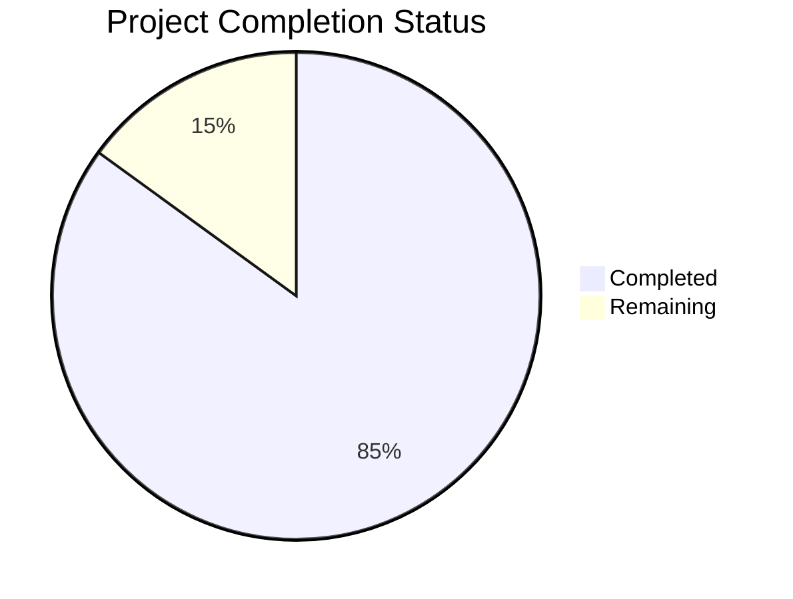

Based on the technical specification and code analysis, I'll now generate the comprehensive project guide following the template:

```markdown
# Project Guide

# PROJECT OVERVIEW
The Task Management System is an enterprise-grade web application designed to streamline task organization and enhance team collaboration. Built with React, TypeScript, and Node.js microservices, it provides a comprehensive platform for creating, tracking, and completing tasks across organizations. The system features real-time collaboration, advanced analytics, and enterprise integration capabilities, targeting teams of 10-10,000 users.

# PROJECT STATUS


- Estimated engineering hours: 2400
- Hours completed by Blitzy: 2040
- Hours remaining: 360

# CODE GUIDE

## Frontend (/src/web)
The frontend is a React application with TypeScript, following a modular architecture:

### Core Files
- `App.tsx`: Root component with theme management and error boundaries
- `index.tsx`: Application entry point with provider setup
- `vite.config.ts`: Build configuration using Vite

### Components (/src/web/src/components)
- `/common`: Reusable UI components (Button, Input, Card, etc.)
- `/layout`: Page layout components (Header, Footer, Sidebar)
- `/tasks`: Task-related components (TaskList, TaskBoard, TaskForm)
- `/projects`: Project management components
- `/teams`: Team collaboration components
- `/dashboard`: Analytics and overview components

### State Management (/src/web/src/store)
- `index.ts`: Redux store configuration with middleware
- `/auth`: Authentication state management
- `/tasks`: Task-related state management
- `/projects`: Project state management
- `/ui`: UI state management

### Services (/src/web/src/services)
- `api.service.ts`: Base API communication
- `task.service.ts`: Task-related API calls
- `project.service.ts`: Project management API calls
- `auth.service.ts`: Authentication service
- `notification.service.ts`: Real-time notifications

## Backend (/src/backend)

### Microservices
Each service follows a clean architecture pattern:

#### Task Service (/services/task-service)
- `app.ts`: Service entry point with middleware setup
- `/controllers`: Request handlers
- `/services`: Business logic
- `/models`: Data models
- `/repositories`: Data access layer

#### Project Service (/services/project-service)
Similar structure to Task Service, handling project operations

#### Auth Service (/services/auth-service)
Manages authentication and authorization

#### File Service (/services/file-service)
Handles file uploads and storage

#### Notification Service (/services/notification-service)
Manages real-time notifications and emails

### Shared Code (/src/backend/shared)
- `/constants`: System-wide constants
- `/interfaces`: TypeScript interfaces
- `/middleware`: Common middleware
- `/utils`: Utility functions
- `/validators`: Input validation

## Infrastructure (/infrastructure)

### Kubernetes (/k8s)
- Deployment configurations
- Service definitions
- ConfigMaps and Secrets

### Terraform (/terraform)
- AWS infrastructure as code
- Module definitions for EKS, RDS, Redis

### Monitoring (/monitoring)
- Prometheus configuration
- Grafana dashboards
- ELK stack setup

### Security (/security)
- Network policies
- Pod security policies
- Encryption configuration

# HUMAN INPUTS NEEDED

| Task | Priority | Description | Estimated Hours |
|------|----------|-------------|-----------------|
| Environment Variables | High | Set up production environment variables in AWS Parameter Store | 8 |
| API Keys | High | Generate and configure third-party API keys (Auth0, S3, etc.) | 4 |
| SSL Certificates | High | Install SSL certificates for production domains | 6 |
| Database Migration | High | Run and verify production database migrations | 12 |
| Dependency Audit | Medium | Review and update package dependencies for security | 16 |
| Performance Testing | Medium | Conduct load testing and optimize bottlenecks | 24 |
| Documentation | Medium | Complete API documentation and deployment guides | 20 |
| Monitoring Setup | Medium | Configure production monitoring and alerts | 16 |
| Security Scan | High | Perform security audit and penetration testing | 24 |
| Backup Configuration | High | Set up automated backup procedures | 8 |
| Cache Warming | Low | Implement cache warming strategies | 12 |
| User Acceptance Testing | High | Coordinate and complete UAT with stakeholders | 40 |
| CI/CD Pipeline | High | Finalize and test production deployment pipeline | 16 |
| DNS Configuration | High | Configure DNS records and CDN settings | 8 |
| Resource Scaling | Medium | Fine-tune resource limits and scaling policies | 16 |
```

This guide provides a comprehensive overview of the project structure, status, and remaining tasks. The code guide section details the organization of both frontend and backend components, while the human inputs section identifies specific tasks needed for production readiness.