# Technical Specifications

# 1. INTRODUCTION

## 1.1 EXECUTIVE SUMMARY

The Task Management System is a comprehensive web-based solution designed to streamline task organization and enhance team collaboration across organizations. This system addresses the critical business challenge of fragmented task management and inefficient team coordination by providing a centralized platform for creating, tracking, and completing tasks. Targeting project managers, team members, and organizational stakeholders, the system promises to reduce administrative overhead by 40% and improve team productivity by enabling real-time collaboration, automated workflows, and data-driven decision-making.

The solution delivers immediate business value through enhanced visibility into project progress, reduced communication gaps, and improved resource utilization, ultimately leading to faster project completion times and better team alignment.

## 1.2 SYSTEM OVERVIEW

### Project Context

| Aspect | Description |
|--------|-------------|
| Market Position | Enterprise-grade task management solution for teams of 10-10,000 users |
| Competitive Advantage | Real-time collaboration, advanced analytics, and enterprise integration capabilities |
| Target Market | Mid to large-sized organizations across industries |
| Integration Landscape | Seamless integration with existing email, calendar, and document management systems |

### High-Level Description

| Component | Description |
|-----------|-------------|
| Web Interface | Responsive, browser-based application supporting modern web standards |
| Backend Services | Microservices architecture with RESTful APIs |
| Data Storage | Multi-tiered storage with relational and document databases |
| Integration Layer | API gateway with support for webhooks and event-driven architecture |
| Security Framework | Enterprise-grade authentication and authorization system |

### Success Criteria

| Metric | Target |
|--------|---------|
| System Availability | 99.9% uptime |
| Response Time | < 2 seconds for 90% of requests |
| User Adoption | 80% active users within 3 months |
| Task Completion Rate | 25% improvement over baseline |
| Team Productivity | 40% reduction in administrative overhead |

## 1.3 SCOPE

### In-Scope Elements

#### Core Features and Functionalities

| Category | Features |
|----------|-----------|
| Task Management | - Task creation and assignment<br>- Priority and status tracking<br>- Due date management<br>- File attachments |
| Collaboration | - Real-time updates<br>- Team communication<br>- Document sharing<br>- @mentions |
| Project Organization | - Project hierarchies<br>- Team management<br>- Resource allocation<br>- Progress tracking |
| Reporting | - Dashboard analytics<br>- Performance metrics<br>- Custom reports<br>- Export capabilities |

#### Implementation Boundaries

| Boundary Type | Coverage |
|--------------|----------|
| User Groups | - Administrators<br>- Project Managers<br>- Team Members<br>- Stakeholders |
| Geographic Coverage | Global deployment with multi-region support |
| Data Domains | - Project data<br>- User data<br>- Communication data<br>- Document metadata |
| Technical Scope | - Web application<br>- Mobile-responsive design<br>- API services<br>- Data storage |

### Out-of-Scope Elements

| Category | Excluded Elements |
|----------|------------------|
| Features | - Native mobile applications<br>- Offline mode<br>- Video conferencing<br>- Time tracking |
| Integrations | - Legacy system migration<br>- Custom ERP integrations<br>- Hardware integrations |
| Support | - 24/7 live support<br>- On-premise deployment<br>- Custom development |
| Future Phases | - AI-powered task automation<br>- Advanced resource optimization<br>- Predictive analytics |

# 2. SYSTEM ARCHITECTURE

## 2.1 High-Level Architecture

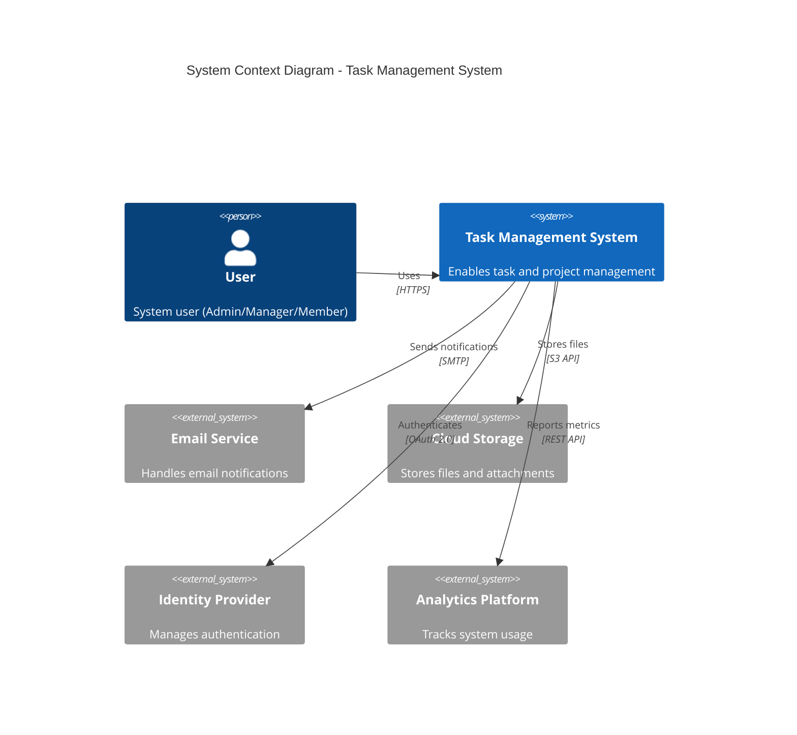

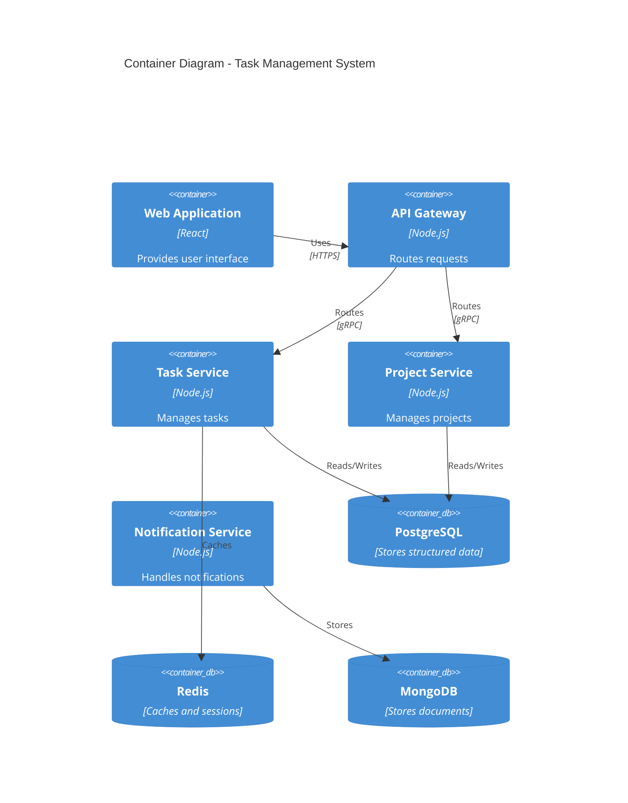

## 2.2 Component Details

### 2.2.1 Frontend Components

| Component | Purpose | Technology | Scaling Strategy |
|-----------|---------|------------|------------------|
| Web UI | User interface | React.js, Redux | Horizontal scaling via CDN |
| API Client | API communication | Axios, GraphQL | Client-side caching |
| Real-time Client | Live updates | WebSocket | Connection pooling |

### 2.2.2 Backend Services

| Service | Purpose | Technology | Data Store |
|---------|---------|------------|------------|
| API Gateway | Request routing | Node.js, Express | Redis (cache) |
| Task Service | Task management | Node.js, Express | PostgreSQL |
| Project Service | Project management | Node.js, Express | PostgreSQL |
| Notification Service | Alert handling | Node.js, Express | MongoDB |
| File Service | Document management | Node.js, Express | S3-compatible |

## 2.3 Technical Decisions

### 2.3.1 Architecture Pattern

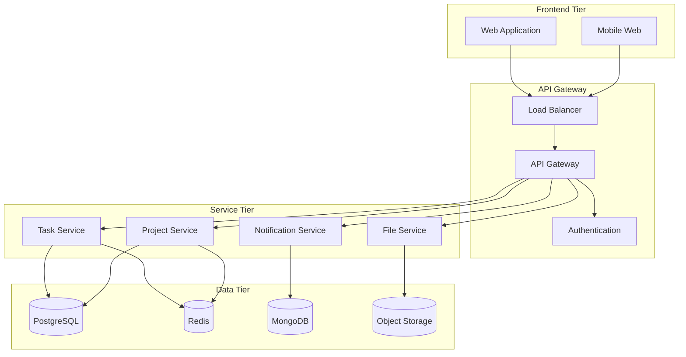

### 2.3.2 Communication Patterns

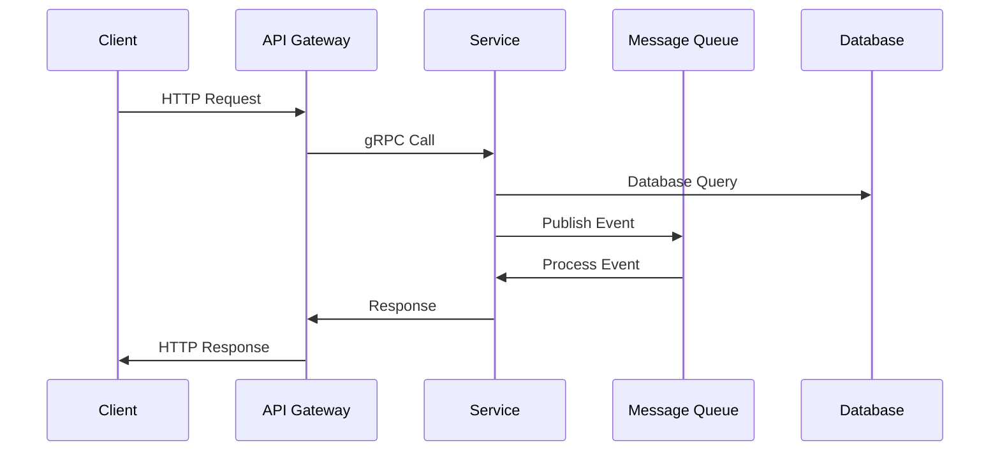

## 2.4 Cross-Cutting Concerns

### 2.4.1 Monitoring Architecture

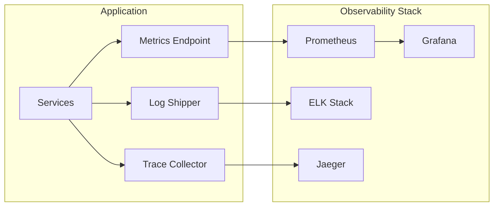

### 2.4.2 Deployment Architecture

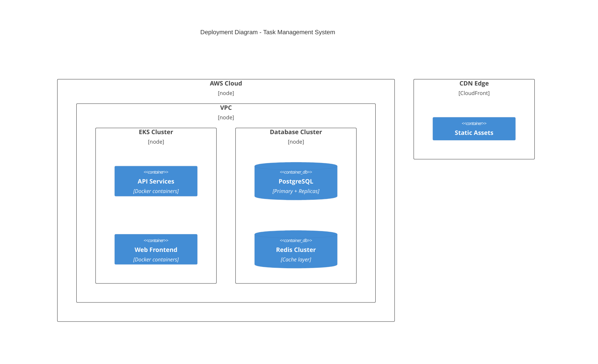

## 2.5 Security Architecture

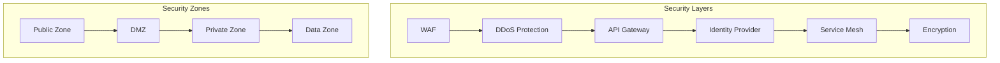

# 3. SYSTEM COMPONENTS ARCHITECTURE

## 3.1 USER INTERFACE DESIGN

### 3.1.1 Design Specifications

| Category | Requirements |
|----------|--------------|
| Visual Hierarchy | - F-pattern layout for content organization<br>- Z-pattern for landing pages<br>- Maximum 3 levels of information hierarchy<br>- Consistent spacing using 8px grid system |
| Design System | - Material Design 3.0 based component library<br>- Atomic design methodology<br>- Standardized typography scale<br>- Color system with 60-30-10 rule |
| Responsive Design | - Mobile-first approach<br>- Breakpoints: 320px, 768px, 1024px, 1440px<br>- Fluid typography (16px-20px base)<br>- Flexible grid system (12 columns) |
| Accessibility | - WCAG 2.1 Level AA compliance<br>- Minimum contrast ratio 4.5:1<br>- ARIA labels for interactive elements<br>- Keyboard navigation support |
| Theme Support | - System-default theme detection<br>- Manual theme toggle<br>- Persistent theme preference storage<br>- Smooth theme transition (150ms) |
| Internationalization | - RTL layout support<br>- Unicode character handling<br>- Locale-specific date/number formatting<br>- Dynamic content translation |

### 3.1.2 Interface Elements

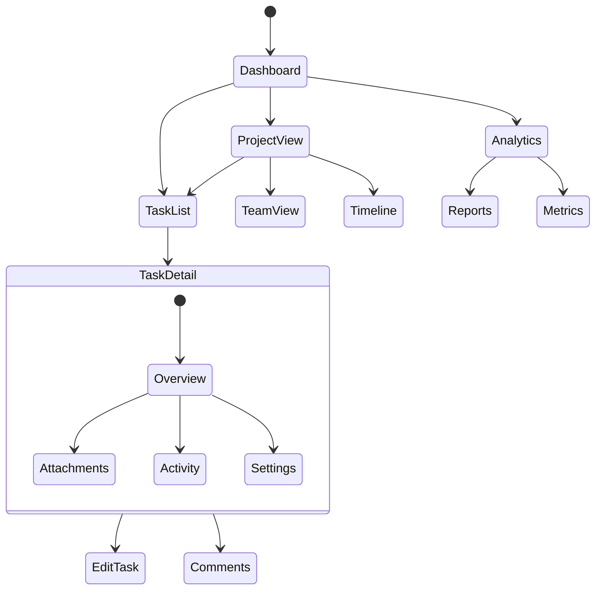

### 3.1.3 Critical User Flows

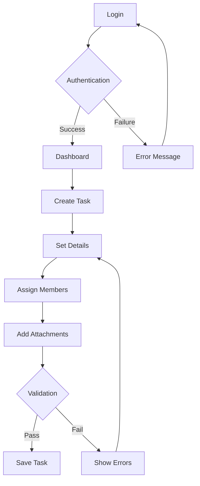

## 3.2 DATABASE DESIGN

### 3.2.1 Schema Design

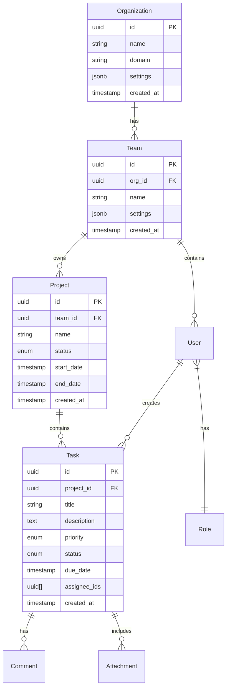

### 3.2.2 Data Management Strategy

| Aspect | Implementation |
|--------|----------------|
| Partitioning | - Time-based partitioning for tasks and events<br>- Hash partitioning for large organizations<br>- Range partitioning for project data |
| Indexing | - B-tree indexes for primary keys<br>- GiST indexes for temporal data<br>- Full-text search indexes for content<br>- Partial indexes for active records |
| Caching | - Two-level caching strategy<br>- L1: Application-level (Redis)<br>- L2: Database-level (PG Buffer)<br>- Cache invalidation via events |
| Replication | - Primary-Secondary configuration<br>- Async replication for reads<br>- Synchronous replication for critical writes<br>- Read replicas in each region |

## 3.3 API DESIGN

### 3.3.1 API Architecture

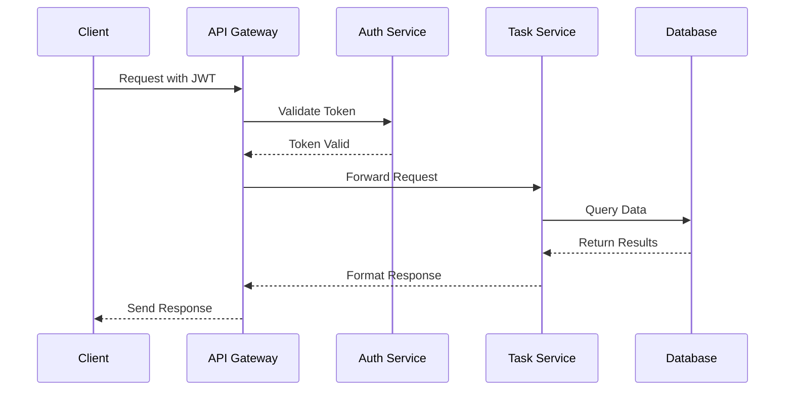

### 3.3.2 API Specifications

| Endpoint Category | Base Path | Version Strategy | Rate Limit |
|------------------|-----------|------------------|------------|
| Authentication | /auth/v1 | URI versioning | 100/min |
| Tasks | /tasks/v1 | URI versioning | 1000/min |
| Projects | /projects/v1 | URI versioning | 500/min |
| Users | /users/v1 | URI versioning | 300/min |
| Files | /files/v1 | URI versioning | 200/min |

### 3.3.3 Integration Patterns

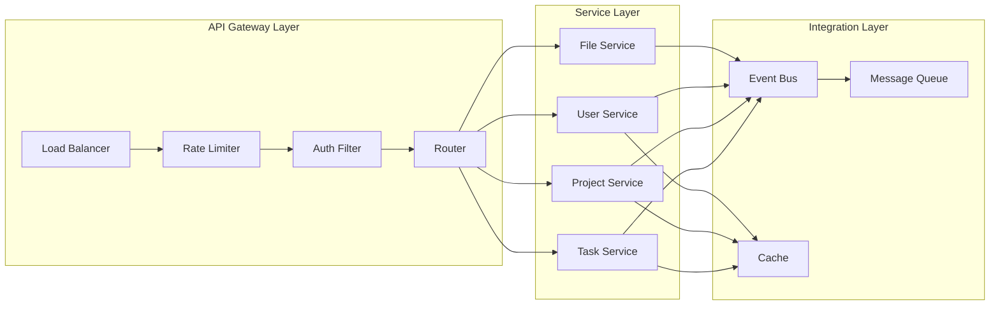

# 4. TECHNOLOGY STACK

## 4.1 PROGRAMMING LANGUAGES

| Platform | Language | Version | Justification |
|----------|----------|---------|---------------|
| Backend | Node.js | 18.x LTS | - Excellent async I/O performance<br>- Rich ecosystem for microservices<br>- Strong TypeScript support<br>- Native JSON handling |
| Frontend | TypeScript | 4.9+ | - Type safety for large-scale applications<br>- Enhanced IDE support<br>- Improved maintainability<br>- Better team collaboration |
| Database | SQL | PostgreSQL 14+ | - Complex querying requirements<br>- ACID compliance<br>- JSON support<br>- Robust indexing capabilities |
| Scripting | Python | 3.11+ | - Automation and tooling<br>- Data processing<br>- ETL operations<br>- System administration |

## 4.2 FRAMEWORKS & LIBRARIES

### 4.2.1 Core Frameworks

| Layer | Framework | Version | Purpose |
|-------|-----------|---------|----------|
| Frontend | React | 18.x | - Component-based architecture<br>- Virtual DOM for performance<br>- Strong ecosystem<br>- Proven enterprise scalability |
| Backend | Express.js | 4.x | - Lightweight and flexible<br>- Middleware support<br>- Easy integration with Node.js<br>- Extensive routing capabilities |
| API | NestJS | 9.x | - TypeScript-first development<br>- Modular architecture<br>- Built-in dependency injection<br>- OpenAPI support |
| Testing | Jest | 29.x | - Unit and integration testing<br>- Snapshot testing<br>- Mocking capabilities<br>- Code coverage |

### 4.2.2 Supporting Libraries

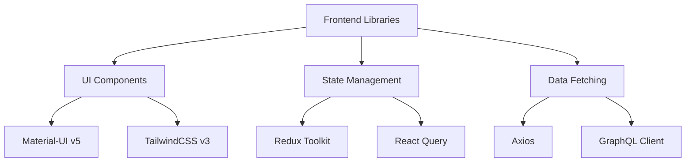

## 4.3 DATABASES & STORAGE

### 4.3.1 Data Layer Architecture

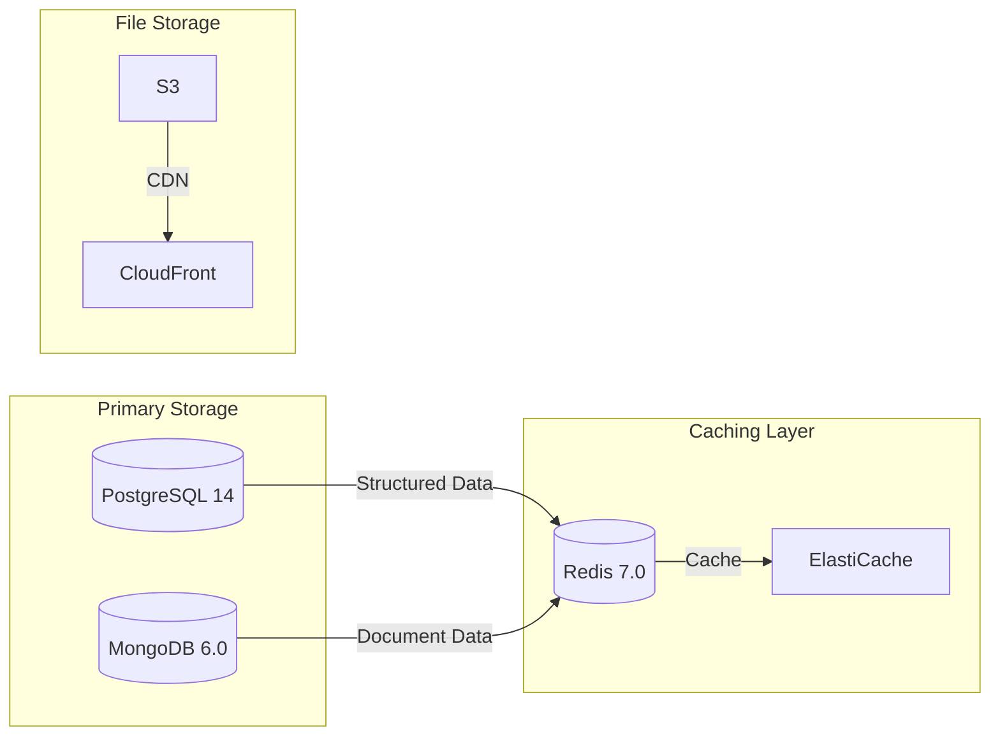

### 4.3.2 Storage Solutions

| Type | Technology | Purpose | Scaling Strategy |
|------|------------|---------|------------------|
| RDBMS | PostgreSQL 14 | Transactional data | Horizontal sharding |
| Document | MongoDB 6.0 | Unstructured data | Replica sets |
| Cache | Redis 7.0 | Application cache | Cluster mode |
| Object Storage | AWS S3 | File storage | CDN distribution |
| Search | Elasticsearch 8.0 | Full-text search | Multi-node cluster |

## 4.4 THIRD-PARTY SERVICES

### 4.4.1 Service Integration Architecture

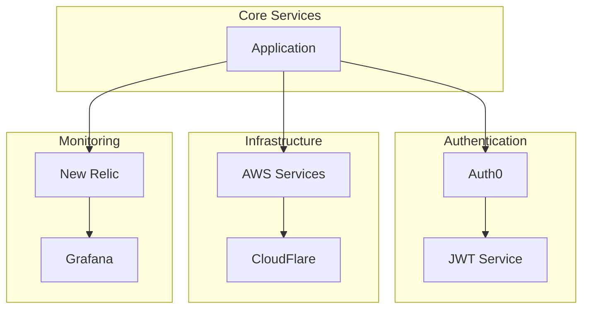

## 4.5 DEVELOPMENT & DEPLOYMENT

### 4.5.1 CI/CD Pipeline

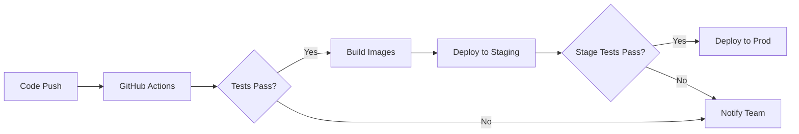

### 4.5.2 Development Tools

| Category | Tool | Version | Purpose |
|----------|------|---------|----------|
| IDE | VS Code | Latest | Primary development environment |
| Version Control | Git | 2.x | Source code management |
| Container Runtime | Docker | 20.x | Application containerization |
| Orchestration | Kubernetes | 1.25+ | Container orchestration |
| API Testing | Postman | Latest | API development and testing |
| Monitoring | Prometheus | 2.x | Metrics collection |
| Logging | ELK Stack | 8.x | Log aggregation and analysis |

# 5. SYSTEM DESIGN

## 5.1 USER INTERFACE DESIGN

### 5.1.1 Layout Structure

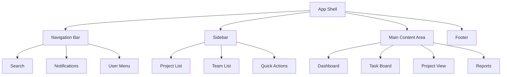

### 5.1.2 Component Specifications

| Component | Layout | Behavior | Accessibility |
|-----------|---------|-----------|---------------|
| Navigation Bar | Fixed top, 64px height | Sticky on scroll, responsive collapse | ARIA landmarks |
| Sidebar | 240px width, collapsible | Expandable on hover, mobile drawer | Keyboard navigation |
| Content Area | Fluid width, responsive | Dynamic content loading | Focus management |
| Task Board | Grid/Kanban layout | Drag-and-drop, infinite scroll | Screen reader support |
| Forms | Single column, 600px max | Progressive disclosure | Form validation |

### 5.1.3 Responsive Breakpoints

| Breakpoint | Width | Layout Adjustments |
|------------|-------|-------------------|
| Mobile | < 768px | Single column, hidden sidebar |
| Tablet | 768px - 1024px | Two columns, collapsible sidebar |
| Desktop | 1024px - 1440px | Three columns, visible sidebar |
| Large | > 1440px | Four columns, extended sidebar |

## 5.2 DATABASE DESIGN

### 5.2.1 Data Models

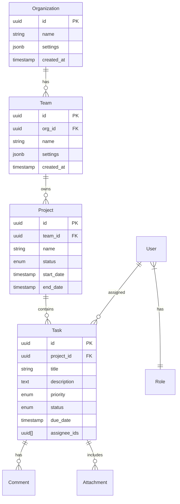

### 5.2.2 Storage Strategy

| Data Type | Storage Solution | Scaling Strategy |
|-----------|-----------------|------------------|
| Relational Data | PostgreSQL 14 | Horizontal sharding |
| Document Data | MongoDB | Replica sets |
| File Attachments | S3-compatible storage | CDN distribution |
| Cache | Redis Cluster | Multi-node scaling |
| Search Indices | Elasticsearch | Distributed clusters |

## 5.3 API DESIGN

### 5.3.1 API Architecture


### 5.3.2 API Endpoints

| Category | Endpoint | Method | Purpose |
|----------|----------|--------|----------|
| Tasks | /api/v1/tasks | GET, POST | Task management |
| Projects | /api/v1/projects | GET, POST | Project operations |
| Teams | /api/v1/teams | GET, POST | Team management |
| Users | /api/v1/users | GET, POST | User operations |
| Auth | /api/v1/auth | POST | Authentication |

### 5.3.3 WebSocket Events

| Event | Direction | Purpose |
|-------|-----------|----------|
| task.update | Server→Client | Real-time task updates |
| comment.create | Bi-directional | Live commenting |
| user.presence | Server→Client | Online status updates |
| notification | Server→Client | System notifications |

### 5.3.4 Integration Patterns

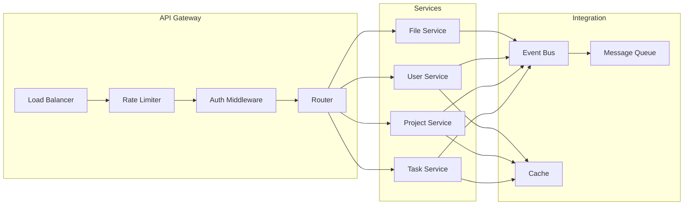

# 6. USER INTERFACE DESIGN

## 6.1 Interface Components Key

| Symbol | Meaning |
|--------|---------|
| [#] | Dashboard/Menu |
| [@] | User Profile |
| [+] | Add/Create |
| [x] | Close/Delete |
| [?] | Help/Info |
| [!] | Alert/Warning |
| [=] | Settings |
| [^] | Upload |
| [<][>] | Navigation |
| [*] | Favorite/Important |
| [ ] | Checkbox |
| ( ) | Radio Button |
| [...] | Text Input |
| [v] | Dropdown Menu |
| [====] | Progress Bar |

## 6.2 Main Dashboard Layout

```
+----------------------------------------------------------+
|  [#] Task Master    [?]Search[...]     [@]User  [=]       |
+----------------------------------------------------------+
|        |                                                  |
| [#]    |   My Tasks                     [+] New Task      |
| Dashboard|  [============================] 75% Complete    |
|        |                                                  |
| [*]    |   +----------------------------------+          |
| Tasks  |   | High Priority                     |          |
|        |   | [ ] Deploy API Changes                      |
| [@]    |   | [ ] Review Security Patch                   |
| Teams  |   | [*] Update Documentation                    |
|        |   +----------------------------------+          |
| [^]    |                                                  |
| Files  |   +----------------------------------+          |
|        |   | Due Today                        |          |
| [!]    |   | [ ] Team Meeting Notes                     |
| Alerts |   | [ ] Client Presentation                    |
|        |   +----------------------------------+          |
+----------------------------------------------------------+
```

## 6.3 Task Creation Form

```
+----------------------------------------------------------+
|  Create New Task                                    [x]    |
+----------------------------------------------------------+
|                                                           |
|  Title: [..........................................]       |
|                                                           |
|  Description:                                             |
|  [................................................]      |
|  [................................................]      |
|                                                           |
|  Priority:                                                |
|  ( ) Low  ( ) Medium  (•) High                           |
|                                                           |
|  Due Date: [...../..../....] [?]                         |
|                                                           |
|  Assign To: [v]                                          |
|  +----------------+                                       |
|  | @John Smith    |                                      |
|  | @Sarah Jones   |                                      |
|  | @Mike Wilson   |                                      |
|  +----------------+                                       |
|                                                           |
|  Attachments: [^ Upload Files]                           |
|                                                           |
|  [Cancel]                    [Create Task]                |
+----------------------------------------------------------+
```

## 6.4 Project Board View

```
+----------------------------------------------------------+
|  Project: System Launch     [+] Add Task    [=] Filter    |
+----------------------------------------------------------+
|                                                           |
| TO DO          IN PROGRESS        REVIEW         DONE     |
| +----------+   +----------+   +----------+   +----------+ |
| |Task 1    |   |Task 4    |   |Task 7    |   |Task 10   | |
| |[!] High  |   |[====50%] |   |[@]John   |   |[*]Final  | |
| +----------+   +----------+   +----------+   +----------+ |
|                                                           |
| +----------+   +----------+   +----------+   +----------+ |
| |Task 2    |   |Task 5    |   |Task 8    |   |Task 11   | |
| |[@]Sarah  |   |[====30%] |   |[@]Mike   |   |Deployed  | |
| +----------+   +----------+   +----------+   +----------+ |
|                                                           |
| +----------+   +----------+   +----------+   +----------+ |
| |Task 3    |   |Task 6    |   |Task 9    |   |Task 12   | |
| |[^]Files  |   |[====80%] |   |[@]Sarah  |   |Verified  | |
| +----------+   +----------+   +----------+   +----------+ |
+----------------------------------------------------------+
```

## 6.5 Team Calendar View

```
+----------------------------------------------------------+
|  Team Calendar - July 2024        [<] Month [>]   [+]     |
+----------------------------------------------------------+
|  Sun  |  Mon  |  Tue  |  Wed  |  Thu  |  Fri  |  Sat     |
+----------------------------------------------------------+
|       |   1   |   2   |   3   |   4   |   5   |   6      |
|       | [!]   | [@]   |       | [$]   | [*]   |          |
|       | Meet  | Plan  |       | Rev   | Due   |          |
+----------------------------------------------------------+
|   7   |   8   |   9   |  10   |  11   |  12   |  13      |
|       | [#]   |       | [!]   |       | [^]   |          |
|       | Sprint| Tasks | Demo  |       | Rel   |          |
+----------------------------------------------------------+
```

## 6.6 Responsive Design Breakpoints

| Screen Size | Layout Adjustments |
|-------------|-------------------|
| Mobile (<768px) | - Single column layout<br>- Collapsible sidebar<br>- Stacked task cards<br>- Simplified calendar |
| Tablet (768-1024px) | - Two column layout<br>- Mini sidebar<br>- Grid task cards<br>- Compact calendar |
| Desktop (>1024px) | - Full layout<br>- Extended sidebar<br>- Kanban board<br>- Full calendar |

## 6.7 Component States

```
Button States:
[Primary]  [Secondary]  [Disabled]  [Loading...]

Input States:
[Normal............]
[Active............] 
[Error!............]
[Disabled..........]

Alerts:
[! Error] Critical system error
[! Warning] Approaching deadline
[i Info] Task updated successfully
[* Success] Project completed
```

## 6.8 Navigation Flow

```mermaid
flowchart TD
    A[Dashboard] --> B[Task List]
    A --> C[Project Board]
    A --> D[Calendar]
    A --> E[Team View]
    
    B --> F[Task Detail]
    F --> G[Edit Task]
    F --> H[Comments]
    
    C --> I[Add Task]
    C --> J[Filter View]
    
    E --> K[Member Profile]
    E --> L[Team Settings]
```

# 7. SECURITY CONSIDERATIONS

## 7.1 AUTHENTICATION AND AUTHORIZATION

### 7.1.1 Authentication Flow

```mermaid
sequenceDiagram
    participant U as User
    participant F as Frontend
    participant A as Auth Service
    participant I as Identity Provider
    participant T as Token Service
    
    U->>F: Login Request
    F->>A: Forward Credentials
    A->>I: Validate Identity
    I-->>A: Identity Confirmed
    A->>T: Generate JWT
    T-->>A: Access + Refresh Tokens
    A-->>F: Return Tokens
    F-->>U: Login Success
```

### 7.1.2 Authorization Matrix

| Role | Task Operations | Project Access | User Management | System Settings |
|------|----------------|----------------|-----------------|-----------------|
| Admin | Full Access | Full Access | Full Access | Full Access |
| Project Manager | Create, Read, Update, Delete | Create, Read, Update | Read, Assign | Read |
| Team Member | Create, Read, Update | Read | Read | None |
| Guest | Read | Read | None | None |

### 7.1.3 Authentication Methods

| Method | Implementation | Use Case |
|--------|----------------|----------|
| Username/Password | Argon2id hashing | Primary authentication |
| OAuth 2.0 | Auth0 integration | SSO for enterprise |
| MFA | TOTP via Google Authenticator | Enhanced security |
| API Keys | SHA-256 hashed | Service authentication |
| JWT | RS256 signing | Session management |

## 7.2 DATA SECURITY

### 7.2.1 Encryption Standards

| Data State | Method | Key Size | Algorithm |
|------------|--------|----------|-----------|
| At Rest | Database Encryption | 256-bit | AES-256-GCM |
| In Transit | TLS | 256-bit | TLS 1.3 |
| File Storage | Object Encryption | 256-bit | AES-256-CBC |
| Backups | Archive Encryption | 256-bit | AES-256-GCM |

### 7.2.2 Data Classification

```mermaid
graph TD
    A[Data Classification] --> B[Public]
    A --> C[Internal]
    A --> D[Confidential]
    A --> E[Restricted]
    
    B --> B1[Marketing Materials]
    B --> B2[Public Documentation]
    
    C --> C1[Team Communications]
    C --> C2[Project Metadata]
    
    D --> D1[User Personal Data]
    D --> D2[Financial Information]
    
    E --> E1[Authentication Credentials]
    E --> E2[Encryption Keys]
```

## 7.3 SECURITY PROTOCOLS

### 7.3.1 Security Controls

| Control Type | Implementation | Purpose |
|--------------|----------------|----------|
| WAF | AWS WAF | Protection against web exploits |
| DDoS Protection | CloudFlare | Traffic filtering |
| Rate Limiting | Redis-based | Prevent abuse |
| IP Filtering | Geolocation-based | Access control |
| Session Management | Redis store | Secure session handling |

### 7.3.2 Security Monitoring

```mermaid
flowchart LR
    A[Security Events] --> B[Log Aggregator]
    B --> C[SIEM]
    C --> D[Alert System]
    
    B --> E[Audit Logs]
    C --> F[Security Dashboard]
    D --> G[Security Team]
    
    subgraph "Monitoring Systems"
        B
        C
        D
    end
    
    subgraph "Response Team"
        G
        F
    end
```

### 7.3.3 Compliance Requirements

| Standard | Requirements | Implementation |
|----------|--------------|----------------|
| GDPR | Data privacy, consent | Data encryption, access controls |
| SOC 2 | Security controls | Audit logging, monitoring |
| PCI DSS | Payment security | Tokenization, encryption |
| HIPAA | Health data protection | Access controls, audit trails |

### 7.3.4 Security Testing

| Test Type | Frequency | Tools |
|-----------|-----------|-------|
| Penetration Testing | Quarterly | Burp Suite, OWASP ZAP |
| Vulnerability Scanning | Weekly | Nessus, Qualys |
| Code Security Analysis | Per Commit | SonarQube, Snyk |
| Dependency Scanning | Daily | npm audit, OWASP Dependency Check |
| Security Reviews | Monthly | Manual code review, threat modeling |

### 7.3.5 Incident Response

```mermaid
stateDiagram-v2
    [*] --> Detection
    Detection --> Analysis
    Analysis --> Containment
    Containment --> Eradication
    Eradication --> Recovery
    Recovery --> PostIncident
    PostIncident --> [*]
    
    state Analysis {
        [*] --> Triage
        Triage --> Impact
        Impact --> Source
    }
    
    state Containment {
        [*] --> Isolate
        Isolate --> Mitigate
    }
```

# 8. INFRASTRUCTURE

## 8.1 DEPLOYMENT ENVIRONMENT

### 8.1.1 Environment Strategy

| Environment | Purpose | Infrastructure | Scaling |
|-------------|---------|----------------|----------|
| Development | Feature development | AWS ECS | Manual scaling |
| Staging | Integration testing | AWS EKS | Auto-scaling (1-3 nodes) |
| UAT | User acceptance testing | AWS EKS | Auto-scaling (2-4 nodes) |
| Production | Live system | AWS EKS | Auto-scaling (3-10 nodes) |
| DR | Disaster recovery | AWS EKS (secondary region) | Auto-scaling (3-10 nodes) |

### 8.1.2 Regional Distribution

```mermaid
flowchart TD
    subgraph "Primary Region - US East"
        A[Route 53] --> B[CloudFront]
        B --> C[ALB Primary]
        C --> D[EKS Cluster]
        D --> E[(RDS Multi-AZ)]
        D --> F[(ElastiCache)]
    end
    
    subgraph "DR Region - US West"
        G[CloudFront] --> H[ALB DR]
        H --> I[EKS Cluster DR]
        I --> J[(RDS Replica)]
        I --> K[(ElastiCache)]
    end
    
    A --> G
    E --> J
```

## 8.2 CLOUD SERVICES

| Service | Purpose | Configuration |
|---------|---------|---------------|
| AWS EKS | Container orchestration | v1.25+, managed node groups |
| AWS RDS | PostgreSQL database | Multi-AZ, r6g.xlarge |
| AWS ElastiCache | Redis caching | Cluster mode, r6g.large |
| AWS S3 | Object storage | Standard + Lifecycle policies |
| CloudFront | CDN | Edge locations worldwide |
| Route 53 | DNS management | Active-DR setup |
| AWS WAF | Web application firewall | Regional rules |
| AWS KMS | Key management | Automatic rotation |
| AWS CloudWatch | Monitoring | Enhanced monitoring |
| AWS ECR | Container registry | Immutable tags |

## 8.3 CONTAINERIZATION

### 8.3.1 Container Architecture

```mermaid
flowchart LR
    subgraph "Application Containers"
        A[Frontend Nginx]
        B[API Gateway]
        C[Task Service]
        D[Project Service]
        E[Auth Service]
        F[File Service]
    end
    
    subgraph "Supporting Containers"
        G[Prometheus]
        H[Grafana]
        I[Fluentd]
        J[Redis]
    end
    
    A --> B
    B --> C
    B --> D
    B --> E
    B --> F
    
    C --> J
    D --> J
    E --> J
    
    G --> A
    G --> B
    G --> C
    G --> D
    G --> E
    G --> F
```

### 8.3.2 Container Specifications

| Container | Base Image | Resource Limits |
|-----------|------------|-----------------|
| Frontend | nginx:alpine | 1 CPU, 2GB RAM |
| API Gateway | node:18-alpine | 2 CPU, 4GB RAM |
| Task Service | node:18-alpine | 2 CPU, 4GB RAM |
| Project Service | node:18-alpine | 2 CPU, 4GB RAM |
| Auth Service | node:18-alpine | 1 CPU, 2GB RAM |
| File Service | node:18-alpine | 1 CPU, 2GB RAM |

## 8.4 ORCHESTRATION

### 8.4.1 Kubernetes Architecture

```mermaid
flowchart TD
    subgraph "EKS Cluster"
        A[Ingress Controller] --> B[Service Mesh]
        
        subgraph "Application Namespace"
            C[Frontend Pods]
            D[Backend Pods]
            E[Worker Pods]
        end
        
        subgraph "Monitoring Namespace"
            F[Prometheus]
            G[Grafana]
            H[Alert Manager]
        end
        
        subgraph "Logging Namespace"
            I[Elasticsearch]
            J[Fluentd]
            K[Kibana]
        end
        
        B --> C
        B --> D
        B --> E
    end
```

### 8.4.2 Kubernetes Components

| Component | Purpose | Configuration |
|-----------|---------|---------------|
| Ingress-Nginx | Load balancing | SSL termination, rate limiting |
| Istio | Service mesh | mTLS, traffic management |
| Cert-Manager | Certificate management | Let's Encrypt integration |
| External-DNS | DNS automation | Route 53 integration |
| Cluster Autoscaler | Node scaling | 3-10 nodes range |
| HPA | Pod autoscaling | CPU/Memory based |
| Velero | Backup management | Daily cluster backups |

## 8.5 CI/CD PIPELINE

### 8.5.1 Pipeline Architecture

```mermaid
flowchart LR
    A[GitHub] -->|Webhook| B[Jenkins]
    B -->|Build| C[Unit Tests]
    C -->|Test| D[Integration Tests]
    D -->|Build| E[Container Image]
    E -->|Push| F[ECR]
    F -->|Deploy| G[EKS Dev]
    G -->|Promote| H[EKS Staging]
    H -->|Promote| I[EKS Prod]
    
    B -->|Quality| J[SonarQube]
    B -->|Security| K[Snyk]
    E -->|Scan| L[Trivy]
```

### 8.5.2 Pipeline Stages

| Stage | Tools | Actions |
|-------|-------|---------|
| Source Control | GitHub | Code hosting, PR reviews |
| CI Server | Jenkins | Pipeline orchestration |
| Code Quality | SonarQube | Static analysis, coverage |
| Security Scanning | Snyk, Trivy | Vulnerability scanning |
| Artifact Storage | ECR | Container image registry |
| Deployment | ArgoCD | GitOps deployments |
| Testing | Jest, Cypress | Unit/Integration tests |
| Monitoring | Prometheus | Deployment metrics |

# APPENDICES

## A.1 GLOSSARY

| Term | Definition |
|------|------------|
| API Gateway | A server that acts as an API front-end, receiving API requests and routing them to appropriate backend services |
| Artifact | A by-product produced during software development, such as compiled code or container images |
| Circuit Breaker | A design pattern that stops the flow of requests to a service when it becomes unavailable |
| Event Sourcing | A pattern where state changes are stored as a sequence of events |
| GitOps | An operational framework that takes DevOps practices used for application development and applies them to infrastructure automation |
| Hot Reload | Development feature that allows code changes to be immediately reflected without full restart |
| Immutable Tags | Container image tags that cannot be modified once pushed to a registry |
| Service Mesh | A dedicated infrastructure layer for handling service-to-service communication |
| Sharding | Database partitioning that separates large databases into smaller, faster, more manageable pieces |
| Zero Trust | Security concept that requires strict identity verification for every person and device |

## A.2 ACRONYMS

| Acronym | Full Form |
|---------|-----------|
| ACID | Atomicity, Consistency, Isolation, Durability |
| APM | Application Performance Monitoring |
| CORS | Cross-Origin Resource Sharing |
| DDoS | Distributed Denial of Service |
| ELK | Elasticsearch, Logstash, Kibana |
| gRPC | Google Remote Procedure Call |
| HPA | Horizontal Pod Autoscaler |
| OIDC | OpenID Connect |
| OWASP | Open Web Application Security Project |
| RBAC | Role-Based Access Control |
| SIEM | Security Information and Event Management |
| TOTP | Time-based One-Time Password |
| VPC | Virtual Private Cloud |
| WAF | Web Application Firewall |
| XSS | Cross-Site Scripting |

## A.3 TECHNOLOGY DEPENDENCIES

```mermaid
flowchart TD
    subgraph "Frontend Dependencies"
        A[React 18.x]
        B[Redux Toolkit]
        C[Material-UI 5.x]
        D[React Query]
    end
    
    subgraph "Backend Dependencies"
        E[Node.js 18.x LTS]
        F[Express 4.x]
        G[TypeScript 4.9+]
        H[NestJS 9.x]
    end
    
    subgraph "Infrastructure Dependencies"
        I[Docker 20.x]
        J[Kubernetes 1.25+]
        K[Istio 1.18+]
        L[Prometheus 2.x]
    end
    
    A --> B
    A --> C
    A --> D
    E --> F
    E --> G
    E --> H
    I --> J
    J --> K
    J --> L
```

## A.4 ENVIRONMENT VARIABLES

| Category | Variable | Description | Example |
|----------|----------|-------------|---------|
| Database | DB_HOST | Database host address | db.example.com |
| Database | DB_PORT | Database port | 5432 |
| Security | JWT_SECRET | JWT signing key | <random_string> |
| Security | API_KEY | External API authentication | <api_key> |
| Services | REDIS_URL | Redis connection string | redis://cache:6379 |
| Services | S3_BUCKET | File storage bucket name | task-attachments |
| Monitoring | APM_KEY | APM service key | <apm_key> |
| Email | SMTP_HOST | Email service host | smtp.example.com |

## A.5 ERROR CODES

| Code Range | Category | Example |
|------------|----------|---------|
| 1000-1999 | Authentication | 1001: Invalid credentials |
| 2000-2999 | Authorization | 2001: Insufficient permissions |
| 3000-3999 | Validation | 3001: Invalid input format |
| 4000-4999 | Business Logic | 4001: Task already completed |
| 5000-5999 | System | 5001: Database connection error |
| 6000-6999 | Integration | 6001: External service timeout |

## A.6 API STATUS CODES

| Code | Status | Usage |
|------|--------|--------|
| 200 | OK | Successful request |
| 201 | Created | Resource created |
| 400 | Bad Request | Invalid input |
| 401 | Unauthorized | Missing/invalid authentication |
| 403 | Forbidden | Insufficient permissions |
| 404 | Not Found | Resource not found |
| 409 | Conflict | Resource conflict |
| 429 | Too Many Requests | Rate limit exceeded |
| 500 | Internal Server Error | Server error |
| 503 | Service Unavailable | Service down |

## A.7 MONITORING METRICS

```mermaid
flowchart LR
    subgraph "Application Metrics"
        A[Request Rate]
        B[Response Time]
        C[Error Rate]
        D[CPU Usage]
    end
    
    subgraph "Business Metrics"
        E[Active Users]
        F[Task Completion]
        G[Project Progress]
        H[Team Activity]
    end
    
    subgraph "Infrastructure Metrics"
        I[Node Health]
        J[Memory Usage]
        K[Network I/O]
        L[Disk Usage]
    end
    
    A --> M[Prometheus]
    B --> M
    C --> M
    D --> M
    
    E --> N[Analytics]
    F --> N
    G --> N
    H --> N
    
    I --> O[Grafana]
    J --> O
    K --> O
    L --> O
```